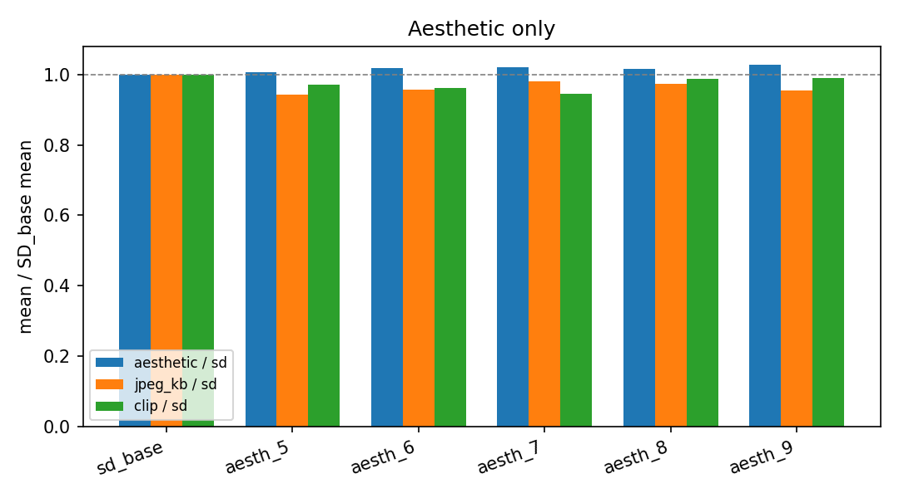
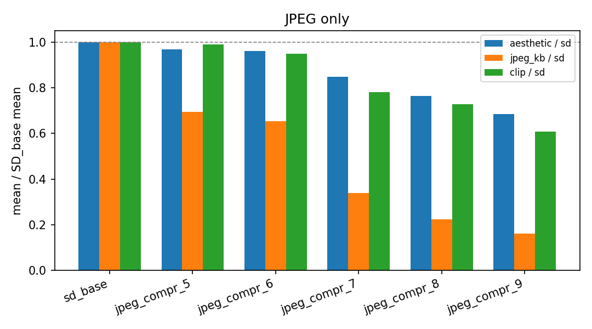
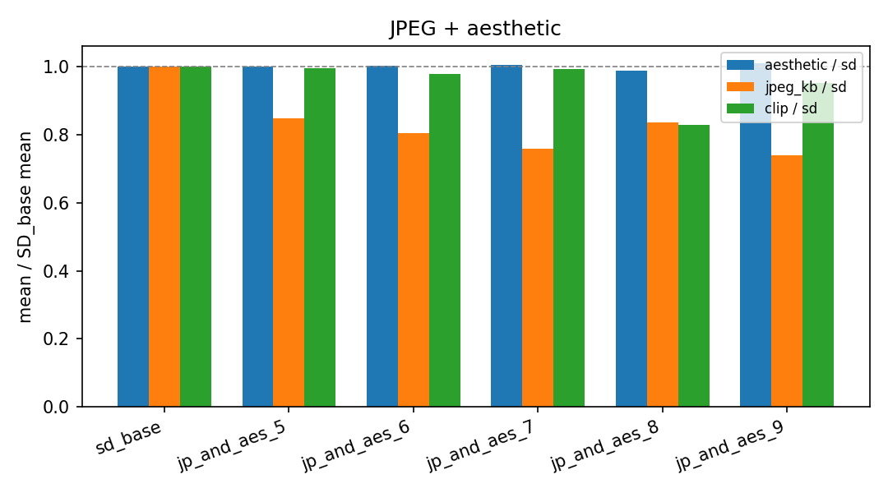
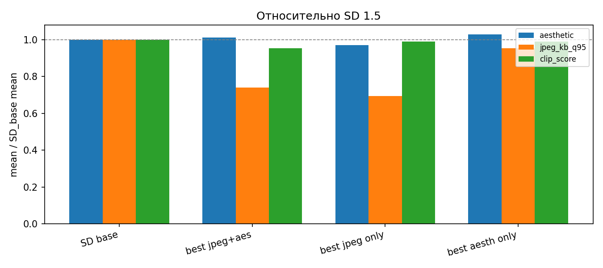
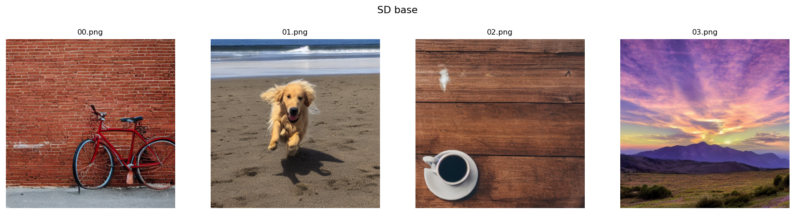
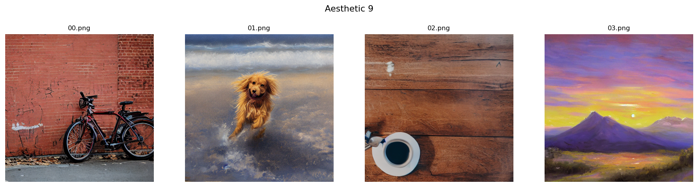
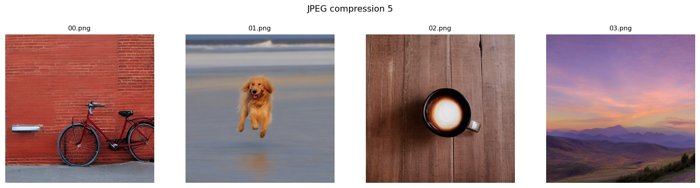
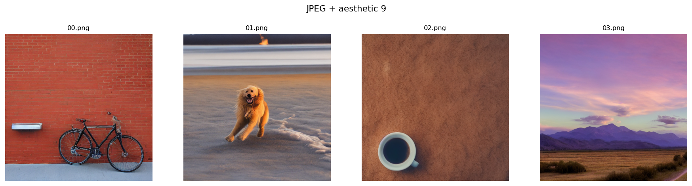

# DDPO + LoRA: отчёт по дообучению Stable Diffusion 1.5

## 1. Метод DDPO

Диффузионная модель задаёт распределение изображений, обусловленное текстом. В DDPO диффузионный процесс интерпретируется как марковская траектория (последовательность шумовых состояний), а обучение формулируется как задача обучения с подкреплением: необходимо оптимизировать политику (параметры UNet), чтобы максимизировать ожидаемую награду от конечного сэмпла.

Данный метод относится к on-policy RL: агент генерирует траектории с помощью текущей политики, получает награду от reward-модели и сразу обновляет параметры.

Процесс генерации в диффузионных моделях представляет собой стохастический переход от гауссовского шума к распределению изображений с учётом условия (timestep и текстовый эмбеддинг промпта). В DDPO переход от состояния $x_t$ в $x_{t-1}$ рассматривается как шаг марковского процесса. На каждом шаге вызывается модель UNet, которая предсказывает параметры перехода (например, шум или среднее нормального распределения), после чего выполняется шаг денойзинга. Такой процесс удобно интерпретировать в терминах RL: каждый шаг денойзинга рассматривается как действие агента, а вся последовательность шагов — как траектория. Обучение происходит следующим образом: сэмплируется траектория, для финального изображения вычисляется награда, после чего параметры обновляются с использованием policy gradient REINFORCE. 

Градиент имеет вид суммы по шагам траектории: $R(x_0) * \sum_{t} \nabla_\theta \log \pi_\theta(x_{t-1} \mid x_t, \text{text})$

На практике лог-вероятности переходов выражаются через выходы UNet (в зависимости от параметризации — предсказание шума, ​$x_0$ или среднего распределения — эти предсказания эквивалентны и выражаются друг через друга).

Для снижения вычислительной стоимости градиент оценивается не по всем шагам траектории, а по случайному подмножеству шагов денойзинга.

При дообучении часто используется LoRA: обучаются только attention-слои внутри UNet, тогда как базовые веса модели остаются замороженными.

---

## 2. Эксперименты

Все прогоны используют **Stable Diffusion v1.5**, гиперпараметры задаются в конфиге config/base.py

В ходе дообучения основные параметры были фиксированы, и менялся только reward scorer. Использовались следующие гиперпараметры: сэмплирование траектории DDIM в 50 шагов, 10 батчей в эпоху, batch_size=4. Обучение производилось на одной видеокарте A100 80GB. Таким образом, за одну эпоху обрабатывалось 40 сэмплов. В каждом эксперименте модели обучались 100 эпох с сохранением 5 последних чекпоинтов. Чекпоинты производились каждые 10 эпох.

Проводилось три эксперимента с разными наградами (по аналогии с экспериментами статьи):

    - на JPEG Compressibility (сжатие объема картинки, сильно коррелирует со "сложностью" паттернов картинки и монотонностью).
    - на Aesthetic Score LAION (оценка эстетичности, реворд-модель обучена на предпочтения людей).
    - взвешенная сумма наград 0.3 JPEG * Compressibility + 0.7 * Aesthetic Score

Датасет для обучения - imagenet_animals (около 400 промптов).

Для оценки дообученных моделей использовались 87 промптов eval/benchmark/prompts/laion_eval_prompts.txt из репозитория LAION.

---

## 3. Оценка

| Метрика | Смысл |
|---------|--------|
| **clip_score** | Косинусная близость эмбеддингов CLIP ViT-L/14 изображения и текста |
| **aesthetic** | Тот же эстетический скорер, что используется в награде aesthetic / hybrid |
| **jpeg_kb_q95** | Размер JPEG в KB при quality=95 |
| **jpeg_compressibility_reward** | \(-\)**jpeg_kb_q95** (чем выше — тем меньше файл) |

Baseline — **предобученная SD 1.5**.

---

## 4. Базовая модель (SD 1.5, без DDPO)

| Метрика | Mean | Std | n |
|---------|------|-----|---|
| clip_score | 0.2694 | 0.0279 | 87 |
| aesthetic | 5.635 | 0.361 | 87 |
| jpeg_kb_q95 (KB) | 120.19 | 35.45 | 87 |

---

## 5. Обучение только на Aesthetic Score

Все чекпоинты улучшают среднюю эстетику относительно базы; JPEG слегка уменьшается относительно базы (картинки становятся чуть меньше в KB при q95), CLIP слегка уменьшается на поздних чекпоинтах - так как он оценивает соответствие текстовому промпту, а модель никак не оптимизировала этот реворд, то такое поведение предсказуемо.

| Run | aesthetic | jpeg_kb_q95 | clip_score | aes / baseline | jpeg / baseline | clip / baseline |
|-----|-----------|-------------|------------|------------|-------------|-------------|
| aesth_5 | 5.670 | 113.24 | 0.2616 | 1.006 | 0.942 | 0.971 |
| aesth_6 | 5.737 | 115.10 | 0.2588 | 1.018 | 0.958 | 0.961 |
| aesth_7 | 5.748 | 117.82 | 0.2543 | 1.020 | 0.980 | 0.944 |
| aesth_8 | 5.717 | 116.97 | 0.2657 | 1.015 | 0.973 | 0.986 |
| **aesth_9** | **5.792** | 114.69 | **0.2663** | **1.028** | 0.954 | **0.989** |

По таблице: лучший средний **aesthetic** — чекпоинт aesthetic 9; по **clip_score** по данным чекпоинтам тоже выигрывает последний чекпоинт.

---

## 6. Обучение только на JPEG Compressibility

Здесь эффект очень сильный по размеру JPEG: средний `jpeg_kb_q95` падает с ~120 KB до ~19 KB на xtrgjbynt 9. Однако также наблюдается резкое падение aesthetic и clip_score: модель находит артефакты распределения, которые хорошо сжимаются, но хуже выглядят и хуже соответствуют тексту по CLIP.

| Run | aesthetic | jpeg_kb_q95 | clip_score | aes / baseline | jpeg / baseline | clip / baseline |
|-----|-----------|-------------|------------|------------|-------------|-------------|
| **jpeg_compr_5** | **5.461** | 83.37 | **0.2667** | 0.969 | 0.694 | **0.990** |
| jpeg_compr_6 | 5.411 | 78.63 | 0.2560 | 0.960 | 0.654 | 0.950 |
| jpeg_compr_7 | 4.778 | 40.76 | 0.2101 | 0.848 | 0.339 | 0.780 |
| jpeg_compr_8 | 4.309 | 26.80 | 0.1959 | 0.765 | 0.223 | 0.727 |
| jpeg_compr_9 | 3.863 | 19.29 | 0.1636 | 0.685 | 0.161 | 0.607 |

По aesthetic среди чекпоинтов модели лучший — ранний **`jpeg_compr_5`**: дальнейшее обучение монотонно жертвует качеством ради сжатия.

---

## 7. Гибрид JPEG + Aesthetic

Взвешенная сумма с весами **0.3 / 0.7** даёт **компромиссный профиль**: aesthetic остаётся на уровне или чуть выше бейзлайна, JPEG заметно ниже базы, но без явного проседания качества, как в чистом JPEG Compressibility. **clip_score** в основном близок к бейзлайну, кроме выброса на 8 чекпоинте (0.223 vs 0.269).

| Run | aesthetic | jpeg_kb_q95 | clip_score | aes / baseline | jpeg / baseline | clip / baseline |
|-----|-----------|-------------|------------|------------|-------------|-------------|
| jp_and_aes_5 | 5.639 | 102.10 | 0.2682 | 1.001 | 0.850 | 0.996 |
| jp_and_aes_6 | 5.652 | 96.85 | 0.2636 | 1.003 | 0.806 | 0.979 |
| jp_and_aes_7 | 5.674 | 91.39 | 0.2676 | 1.007 | 0.760 | 0.993 |
| jp_and_aes_8 | 5.567 | 100.45 | 0.2231 | 0.988 | 0.836 | 0.828 |
| **jp_and_aes_9** | **5.696** | **88.99** | 0.2568 | **1.011** | **0.741** | 0.953 |

Лучший средний **aesthetic** среди чекпоинтов этой модели — чекпоинт 9; лучший **clip** — чекпоинт 5.

---

## 8. Сводная картина по четырём режимам

График сравнения бейзлайнов и лучших чекпоинтов каждой из моделей по aesthetic score. Подробности в `report.ipynb`.

---

## 9. Примеры семплов каждой модели

### SD 1.5 baseline

### Aesthetic-only, checkpoint 9

### JPEG-only, checkpoint 5

### Hybrid 0.3 / 0.7, checkpoint 9

---

## 10. Выводы

1. **DDPO + LoRA** позволяет дообучить SD с минимальными затратами по ресурсам (в сравнении с полностью размороженным UNet), при этом реально повышается качество.
2. **Aesthetic only** даёт рост `aesthetic` (+3% к среднему относительно бейзлайна на лучшем чекпоинте) с **умеренным** влиянием на CLIP и размер JPEG.
3. **JPEG Compressibility only** даёт экстремальное уменьшение размера файла и сильную деградацию эстетики и соответствия тексту — нет большого смысла долго обучать модель только под эту награду, нужно либо комбинировать с чем-то еще, либо обучать всего несколько эпох.
4. **0.3 * Aesthetic +  0.7 * JPEG Compressibility** удерживает эстетику около бейзлайна или чуть выше, заметно снижает JPEG KB и в среднем сохраняет clip_score.

